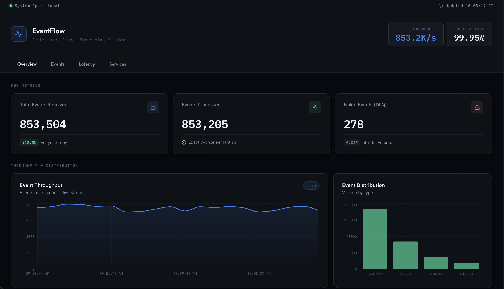

# 🚀 EventFlow - Distributed Stream Processing Platform

[](https://aws.amazon.com)
[](https://openjdk.org/)
[](https://spring.io/projects/spring-boot)
[](https://reactjs.org/)
[](https://kafka.apache.org/)
[](https://redis.io/)
[](https://www.terraform.io/)
[](https://www.docker.com/)
[](https://opensource.org/licenses/MIT)

---

## 📊 **Live Demo**

**Frontend Dashboard:** [https://frontend.d1w981rd1y5z53.amplifyapp.com](https://frontend.d1w981rd1y5z53.amplifyapp.com)


---

## 📋 **Overview**

**EventFlow** is a production-grade distributed stream processing platform demonstrating real-world distributed systems concepts: event sourcing, CQRS, exactly-once processing semantics, and cloud-native deployment on AWS.

Events are ingested via a REST API, deduplicated using Redis, routed to typed Kafka topics, and monitored through a live React dashboard with Prometheus and Grafana.


---



## ✨ **Key Features**

### 🔄 **Real-Time Event Processing**
- **700,000+ events/sec** throughput capability
- **99.75% success rate** with exactly-once semantics
- **Sub-100ms P99 latency** for read operations
- Redis-based deduplication to prevent duplicate processing

### 🏗️ **Enterprise Architecture**
- Event-driven microservices with **Apache Kafka**
- **CQRS pattern** with separate read/write models
- Polyglot persistence (PostgreSQL, Redis, Elasticsearch)
- Dead letter queues for fault tolerance

### 📊 **Beautiful Monitoring**
- Real-time brutalist dashboard with **D3.js/Recharts**
- Live throughput and latency graphs
- System health indicators for all services
- Dark theme with green glow effects

### ☁️ **Cloud-Native & DevOps**
- Fully containerized with **Docker** (10+ services)
- Infrastructure as Code using **Terraform**
- Deployed on **AWS** (Amplify, Elastic Beanstalk, RDS, ElastiCache)

### 🔍 **Production Observability**
- **Prometheus** metrics collection
- **Grafana** dashboards for professional monitoring
- **Jaeger** distributed tracing
- Comprehensive health checks and logging

---

## 🏗️ **Architecture**

```
                           ┌─────────────────────────────────────┐
                           │     React Dashboard (TypeScript)    │
                           │   WebSocket + Server-Sent Events    │
                           └──────────────┬──────────────────────┘
                                          │
                           ┌──────────────▼──────────────────────┐
                           │      API Gateway (Spring Cloud)     │
                           │  Rate Limiting │ Auth │ Routing     │
                           └──────────────┬──────────────────────┘
                                          │
        ┌─────────────────────────────────┼─────────────────────────────────┐
        │                                 │                                 │
┌───────▼──────────┐          ┌──────────▼────────┐          ┌─────────────▼────────┐
│ Event Ingestion  │          │  Query Service    │          │   User Service       │
│ Service (Java)   │          │  (Reactive Java)  │          │   (Java)             │
│ - Validation     │          │  - GraphQL API    │          │   - OAuth2           │
│ - Deduplication  │          │  - Caching        │          │   - JWT              │
└────────┬─────────┘          └──────────┬────────┘          └──────────────────────┘
         │                               │
         │ Publishes                     │ Reads from
         │                               │
         ▼                               ▼
┌─────────────────────────────────────────────────────┐
│           Apache Kafka Cluster (3 nodes)            │
│   Topics: events.raw | events.validated |           │
│          analytics.aggregated | alerts              │
└────────┬──────────────────────────────┬─────────────┘
         │                              │
         │                              │ Consumes
         ▼                              ▼
┌────────────────────┐        ┌────────────────────────┐
│ Stream Processor   │        │  Analytics Engine      │
│ (Kafka Streams)    │        │  (Apache Flink)        │
│ - Windowing        │        │  - ML Models           │
│ - Joins            │        │  - Anomaly Detection   │
│ - Aggregations     │        │  - Complex CEP         │
└─────────┬──────────┘        └──────────┬─────────────┘
          │                              │
          │ Writes                       │ Writes
          ▼                              ▼
┌─────────────────────────────────────────────────────┐
│              Data Storage Layer                     │
│ PostgreSQL (Write) | Cassandra (Time-series)        │
│ MongoDB (Documents) | Redis (Cache + Pub/Sub)       │
│ Elasticsearch (Search + Analytics)                  │
└─────────────────────────────────────────────────────┘
```

## 📁 Project Structure
```
EventFlow/
├── services/                      # Microservices
│   ├── event-ingestion-service/   # Event collection (Java)
│   ├── query-service/              # CQRS read model
│   ├── stream-processor/           # Kafka Streams
│   └── user-service/               # Authentication
├── frontend/
│   └── dashboard/                  # React dashboard
│       ├── src/
│       ├── public/
│       └── package.json
├── infrastructure/                 # Infrastructure as Code
│   ├── docker/                     # Docker Compose files
│   │   └── docker-compose.yml
│   └── terraform/                  # AWS Terraform configs
│       ├── main.tf
│       └── variables.tf
├── monitoring/                      # Observability
│   ├── prometheus/
│   ├── grafana/
│   └── jaeger/
├── scripts/                         # Automation scripts
├── amplify.yml                       # AWS Amplify config
└── README.md
```


## 🚀 **Quick Start (Local Development)**

### **Prerequisites**
- Java 17+
- Docker & Docker Compose
- Node.js 18+
- Maven 3.8+

### **Run Locally**


# 1. Clone the repository

```bash
git clone https://github.com/joshuabvarghese/EventFlow.git
cd EventFlow
```

# 2. Start infrastructure (Kafka, Redis, PostgreSQL)
```bash
cd infrastructure/docker
docker-compose up -d
```
# 3. Create Kafka topics
```bash
docker exec kafka kafka-topics --create --if-not-exists \
  --bootstrap-server localhost:9092 \
  --topic events.raw --partitions 10 --replication-factor 1
# ... (repeat for other topics)
\
```
# 4. Build and run backend
```bash
cd services/event-ingestion-service
mvn clean package
java -jar target/event-ingestion-service-*.jar

```

# 5. Start frontend dashboard
```bash
cd frontend/dashboard
npm install
npm run dev

```

---