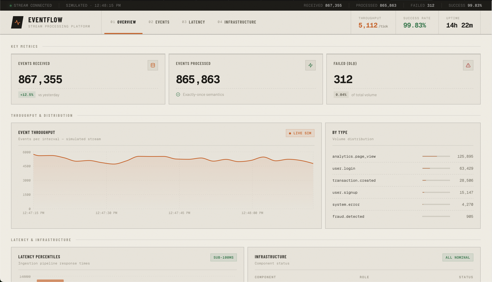

# 🚀 EventFlow - Distributed Stream Processing Platform

[](https://aws.amazon.com)
[](https://openjdk.org/)
[](https://spring.io/projects/spring-boot)
[](https://reactjs.org/)
[](https://kafka.apache.org/)
[](https://redis.io/)
[](https://www.terraform.io/)
[](https://www.docker.com/)
[](https://opensource.org/licenses/MIT)

---

## 📊 **Live Demo**

**Frontend Dashboard:** [https://frontend.d1w981rd1y5z53.amplifyapp.com](https://frontend.d1w981rd1y5z53.amplifyapp.com/)


---

A portfolio project demonstrating distributed systems architecture using Apache Kafka, Redis, and Spring Boot. The goal is to model a production-grade event ingestion and stream processing pipeline, with a React dashboard for visualisation.
 
> **Note on scope:** The backend event ingestion service is implemented. The React dashboard currently runs with simulated data — the UI, charts, and real-time animations are functional, but they are not yet wired to a live backend. Additional microservices (query service, stream processor, user service) are planned but not yet built.
 

---


> The dashboard renders live in the browser with animated metrics. Data is currently simulated client-side; a real backend connection is in progress.

## 📋 Overview
 
EventFlow models a real-world event ingestion pipeline. Events arrive via a REST API, are deduplicated with Redis, published to Kafka topics, and monitored via a React dashboard. The project demonstrates core distributed systems patterns: event sourcing, CQRS, deduplication, and cloud-native deployment on AWS.
 
---
 
## ✨ What's Built
 
### ✅ Implemented
 
**Event Ingestion Service (Java / Spring Boot)**
- REST API for event submission with input validation
- Redis-based deduplication to prevent reprocessing
- Kafka producer publishing to typed topics (`events.raw`, `events.validated`)
- Dead letter queue handling for failed events
- Health check endpoints
**Infrastructure (Docker Compose + Terraform)**
- Docker Compose setup for local development: Kafka, Zookeeper, Redis, PostgreSQL
- Terraform configuration targeting AWS (Elastic Beanstalk, RDS, ElastiCache)
- AWS Amplify deployment for the frontend
**Frontend Dashboard (React / TypeScript)**
- Real-time-style dashboard with D3.js / Recharts
- Throughput, latency, and system health panels
- Dark theme with live-updating charts
- Deployed to AWS Amplify
### 🚧 Planned / In Progress
 
- **Query Service** — CQRS read model, GraphQL API, caching layer
- **Stream Processor** — Kafka Streams windowing and aggregations
- **User Service** — OAuth2 / JWT authentication
- **Live backend connection** — wiring the dashboard to real ingestion service metrics
- **Prometheus + Grafana** — observability stack (config stubs exist)
- **Jaeger** — distributed tracing
---
 
## 🏗️ Architecture
 
```
┌─────────────────────────────────────┐
│     React Dashboard (TypeScript)    │  ← Deployed (simulated data)
└──────────────┬──────────────────────┘
               │ (planned WebSocket / SSE)
┌──────────────▼──────────────────────┐
│      API Gateway (Spring Cloud)     │  ← Planned
└──────────────┬──────────────────────┘
               │
┌──────────────▼──────────────────────┐
│   Event Ingestion Service (Java)    │  ← Implemented
│   - REST API  - Validation          │
│   - Redis deduplication             │
│   - Kafka producer                  │
└──────────────┬──────────────────────┘
               │ Publishes to
┌──────────────▼──────────────────────┐
│   Apache Kafka (Docker / AWS MSK)   │  ← Infra configured
│   topics: events.raw, events.validated │
└──────────────┬──────────────────────┘
               │
┌──────────────▼──────────────────────┐
│   Data Storage Layer                │
│   PostgreSQL (write) · Redis (cache)│  ← Configured in Docker Compose
└─────────────────────────────────────┘
 
Planned additions:
  Query Service · Stream Processor · User Service
  Prometheus · Grafana · Jaeger
```
 
---
 
## 📁 Project Structure
 
```
EventFlow/
├── services/
│   └── event-ingestion-service/   # Java Spring Boot — implemented
├── frontend/
│   └── dashboard/                 # React + TypeScript — deployed (simulated data)
├── infrastructure/
│   ├── docker/docker-compose.yml  # Local dev: Kafka, Redis, PostgreSQL
│   └── terraform/                 # AWS infra (Elastic Beanstalk, RDS, ElastiCache)
├── monitoring/
│   └── grafana/                   # Config stubs
├── scripts/                       # Automation helpers
└── amplify.yml                    # AWS Amplify build config
```
 
---
 
## 🚀 Quick Start (Local)
 
### Prerequisites
 
- Java 17+
- Docker & Docker Compose
- Node.js 18+
- Maven 3.8+
### 1. Clone
 
```bash
git clone https://github.com/joshuabvarghese/EventFlow.git
cd EventFlow
```
 
### 2. Start infrastructure
 
```bash
cd infrastructure/docker
docker-compose up -d
```
 
### 3. Create Kafka topics
 
```bash
docker exec kafka kafka-topics --create --if-not-exists \
  --bootstrap-server localhost:9092 \
  --topic events.raw --partitions 10 --replication-factor 1
 
docker exec kafka kafka-topics --create --if-not-exists \
  --bootstrap-server localhost:9092 \
  --topic events.validated --partitions 10 --replication-factor 1
```
 
### 4. Run the ingestion service
 
```bash
cd services/event-ingestion-service
mvn clean package
java -jar target/event-ingestion-service-*.jar
```
 
### 5. Run the frontend
 
```bash
cd frontend/dashboard
npm install
npm run dev
```
 
---
 
## 🛠️ Tech Stack
 
| Layer | Technology |
|---|---|
| Event ingestion | Java 17, Spring Boot 3.2 |
| Message broker | Apache Kafka 3.6 |
| Deduplication / cache | Redis 7.4 |
| Database | PostgreSQL 15 |
| Frontend | React 18, TypeScript, Recharts, D3.js |
| Infrastructure | Docker, Terraform, AWS |
| Planned observability | Prometheus, Grafana, Jaeger |
 
---
 
## 📄 License
 
MIT

---
